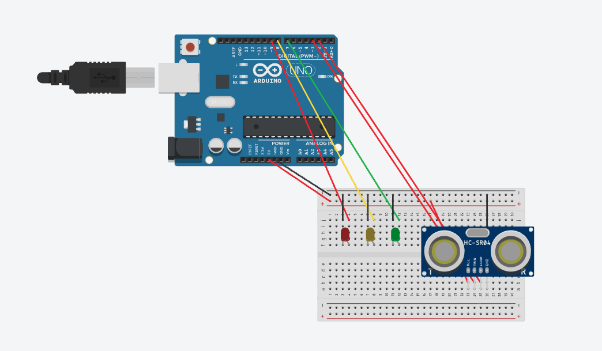

# optimized-left-turn-program

**🚦 Arduino Traffic Light with Ultrasonic Sensor**

This project simulates a traffic light system using an Arduino and an ultrasonic distance sensor.
The ultrasonic sensor detects when an object (e.g., a car) is too close, and the lights respond in real time — overriding the normal cycle for safety.

##

**✨ Features**

Full traffic light cycle (red → green → yellow → red).

Ultrasonic sensor integration to detect nearby cars.

If a car is closer than a threshold (20 cm by default), the system forces the light to red.

Built with non-blocking logic (millis() instead of delay()), so the lights and sensor run “in parallel.”

Code is modular and easy to extend for more advanced traffic control (e.g., optimized left turn, timed extensions).

##

**🛠️ Components**

Arduino Uno (or compatible board)

Ultrasonic sensor (HC-SR04)

3 LEDs (red, yellow, green)

Breadboard + jumper wires

##

**🔌 Circuit Setup**

Below is the wiring for the project:

Red LED → Pin 9

Yellow LED → Pin 8

Green LED → Pin 7

Ultrasonic Sensor →

Trig → Pin 3

Echo → Pin 2

VCC → 5V

GND → GND

##

**📂 Code Overview**

setLight() → switches LEDs and updates timing.

readDistanceCm() → triggers ultrasonic sensor and calculates distance.

loop() → 
Checks the sensor every 60 ms.
Forces RED if a car is detected.
Otherwise cycles through the normal light sequence.

##

